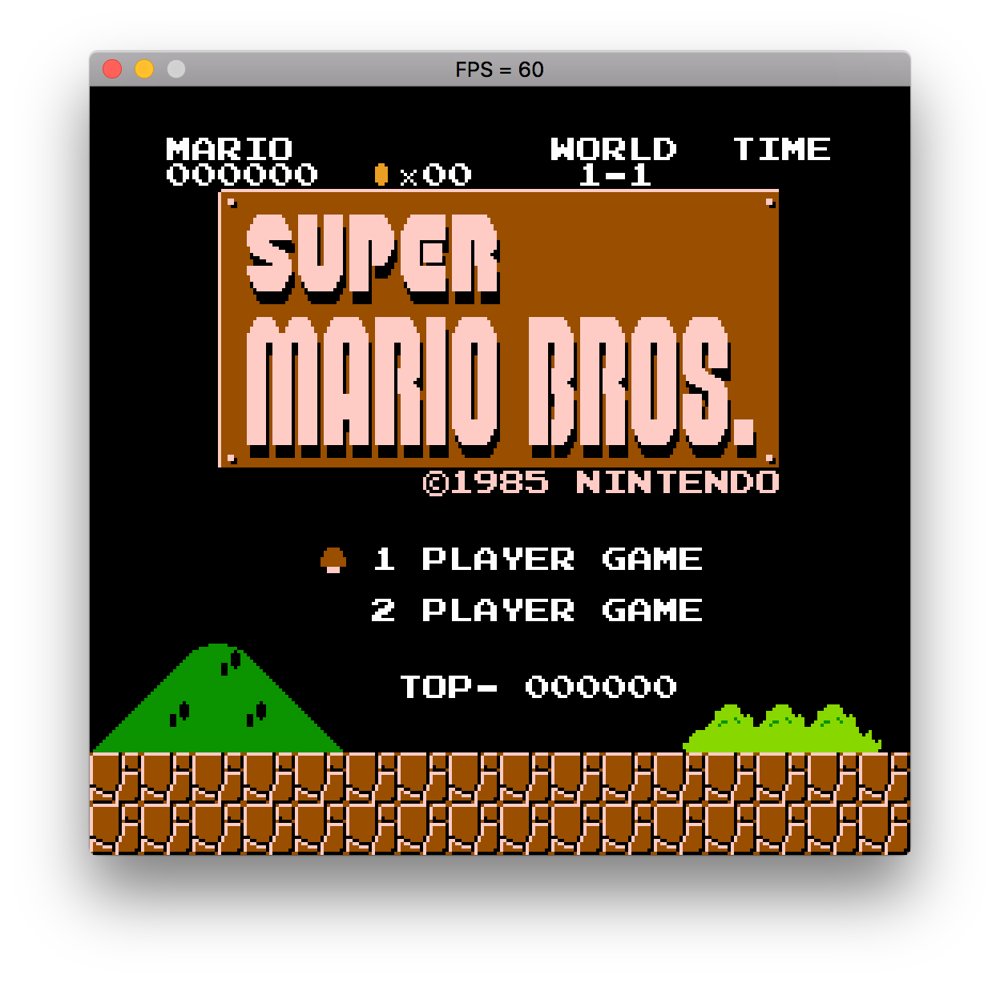
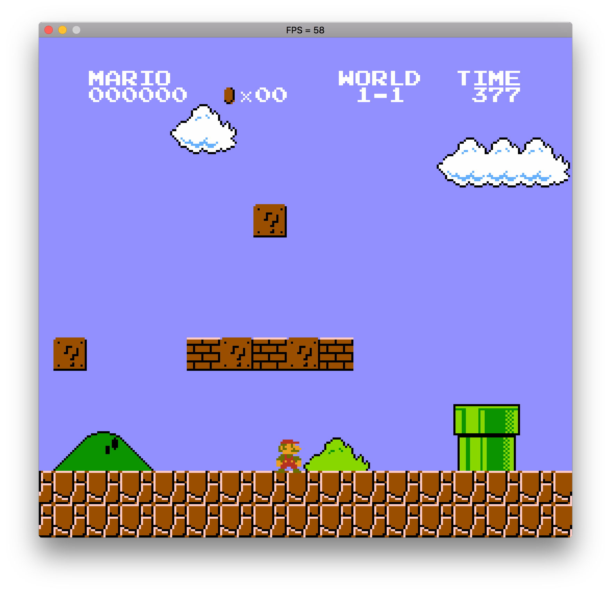
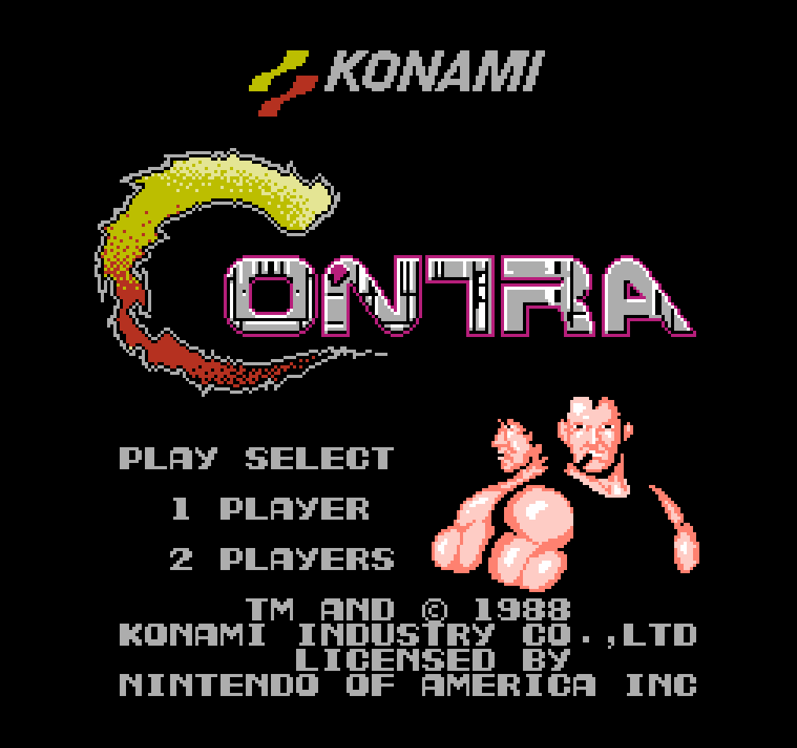
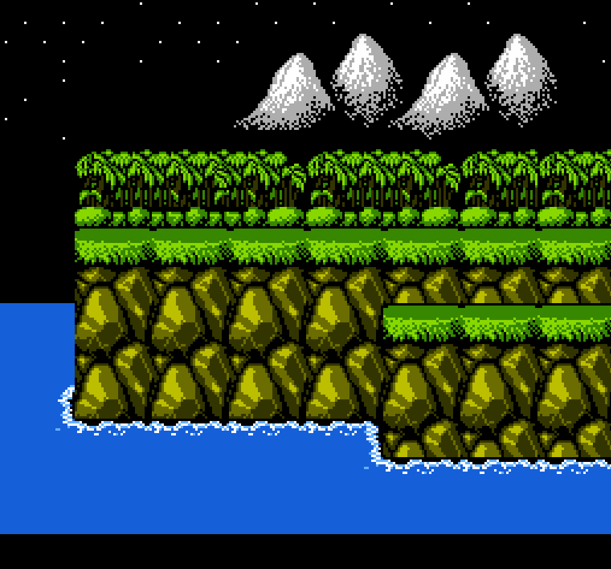

# hnes

Welcome to hnes. hnes is a NES emulator written in Haskell.

## Screenshots

  
   
  
  
  
  

## Controls

| Nintendo              | Emulator    |
| --------------------- | ----------- |
| Up, Down, Left, Right | Arrow Keys  |
| Start                 | Enter       |
| Select                | Space       |
| A                     | Z           |
| B                     | X           |

## Building

hnes uses stack. 

It depends on SDL2, so make sure that's installed. To install:

- _Linux_: `apt-get install libsdl2-dev` (on Ubuntu)
  - _MacOS_: `brew install sdl2`
  - _Windows_:
    - Download dev libs from [here](https://www.libsdl.org/download-2.0.php)
    - Modfiy the `SDL2_MORE_INCLUDE_DIR` variable in `CMakeLists.txt` to point
      to the SDL2 dev libs (or just plop them down into `C:\sdl2\`)

To build hnes:

`stack build`

And to run:

`stack exec -- hnes roms/tests/cpu/nestest/nestest.nes`

## Task list
- [x] Basic structure
- [ ] Mappers
  - [x] Loading roms
  - [x] UNROM/Mapper 2
  - [ ] More mappers
- [ ] CPU
  - [x] All official opcodes
  - [ ] All illegal opcodes
  - [x] Nestest passing
  - [ ] Blarggs CPU test roms passing
- [ ] PPU
  - [x] SDL integration
  - [x] Background rendering
  - [x] Scrolling
  - [ ] Sprite rendering
- [x] Controller input handled
- [x] Performance tuning

