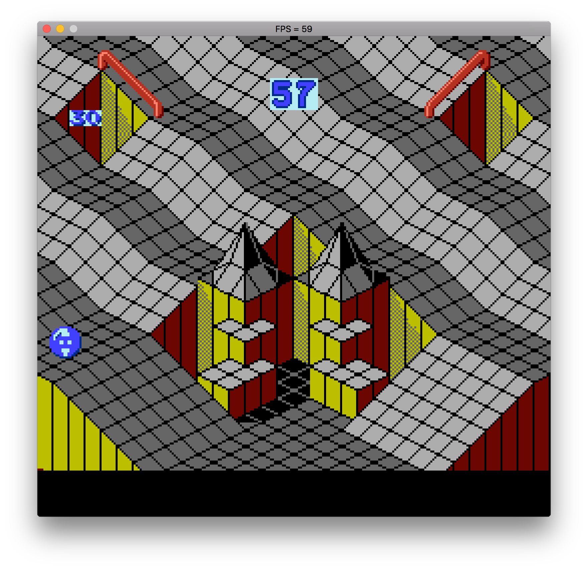
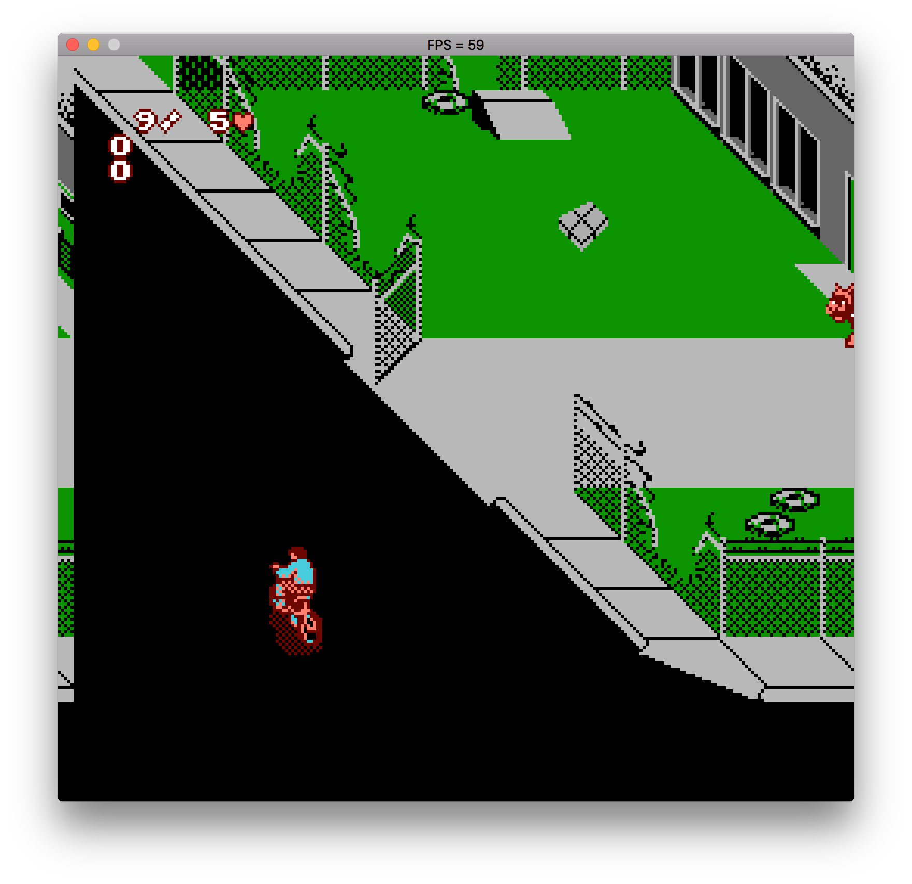
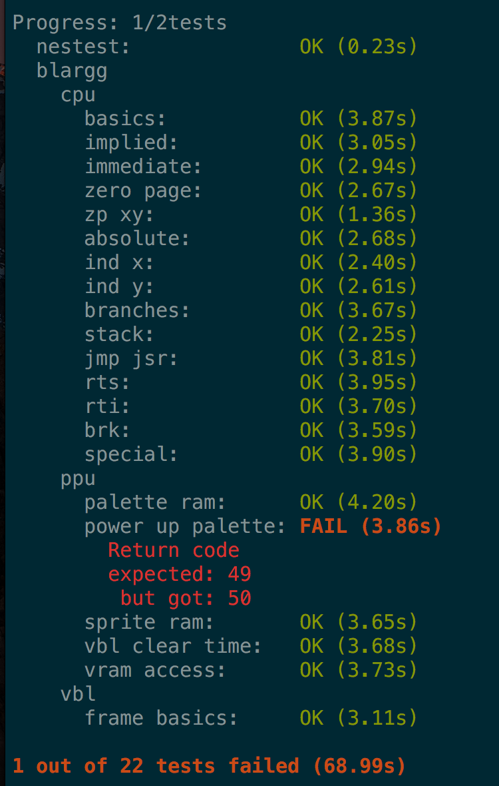
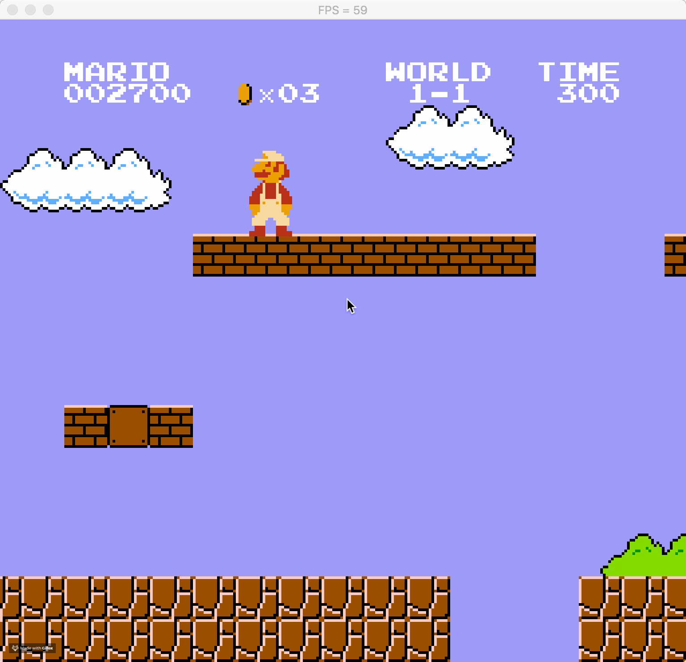

# hnes

Welcome to hnes. hnes is a NES emulator written in Haskell.

## Screenshots

  
  
  
  
  
  
  
  

## Mapper support

The following mappers are supported:

- NROM (0)
- UNROM (2)
- AOROM (7)

Lots of games run, but more don't. You can see which roms are compatible here: http://tuxnes.sourceforge.net/nesmapper.txt The best games seem to be MMC3, so that is a priority.

Mappers are basically custom memory modules that exist on the cartridges themselves, that allow referencing more memory than the NES originally shipped with. Sometimes they even do computation. A very clever idea, but a nightmare to emulate, since each mapper has to be emulated as well

## Controls

| Nintendo              | Emulator    |
| --------------------- | ----------- |
| Up, Down, Left, Right | Arrow Keys  |
| Start                 | Enter       |
| Select                | Space       |
| A                     | Z           |
| B                     | X           |

## Building

[Get Stack](https://haskell-lang.org/get-started) for building Haskell
projects.

Windows instructions:

    $ stack exec -- pacman -Sy mingw-w64-x86_64-pkg-config mingw-w64-x86_64-SDL2
    $ stack build

OS X instructions:

    $ brew install sdl2
    $ stack build

Ubuntu Linux instructions:

    $ sudo apt-get install libsdl2-dev
    $ stack build

FreeBSD instructions:

    $ pkg install sdl2
    $ stack build

## Running

To run:

`stack exec -- hnes roms/tests/cpu/nestest/nestest.nes`

## Task list

- [x] Basic structure
- [ ] Mappers
  - [x] Loading roms
  - [x] Mappers
    - [x] UNROM
    - [x] NROM
    - [x] AOROM
    - [ ] CNROM
    - [ ] MMC1
    - [ ] MMC3
- [ ] CPU
  - [x] All official opcodes
  - [ ] All illegal opcodes
  - [x] Nestest passing
  - [x] Blarggs CPU test roms passing
- [ ] PPU
  - [x] SDL integration
  - [x] Background rendering
  - [x] Scrolling
  - [x] Sprite rendering
  - [ ] VBlank timing for Battletoads edge case
- [ ] APU
- [x] Controller input handled
- [x] Performance tuning
- [ ] Command line interface
  - [ ] Parse args
  - [ ] Use optparse-applicative
  - [ ] Some debug params?

## Tests

There's a small test suite that is used to check for CPU and PPU accuracy. They use test roms rather than hand coding tests.

Just run `stack test`:

## Known issues.

There are so many, where do I even begin.

- Performance is pretty average still. I get around 80 fps on my 2015 i5 MacBook.
- VBlank timing is off. I don't know the exact reasons, but it causes scrolling issues.
- Some issues around mirroring that should be investigated. When you are high up in the map in Super Mario for instance, the screen flickers weirdly:

